```{r, setup, include=FALSE}
knitr::opts_chunk$set(collapse = TRUE)
```

```{r global options, echo = FALSE, force = TRUE, message = FALSE, warning = FALSE}
library(knitr)
library(kableExtra)
```

<br>

------------------------------------------------------------------------

## 1. Instalación de R

Para este curso utilizaremos las últimas versiones de R y Rstudio disponibles a la fecha. Es por esto que si ya tiene instalada cualquiera de las 2 aplicaciones es necesario hacer la actualización correspondiente.

<br>

### 1.1 En Windows

La forma más sencilla de instalar R es a través del sitio web de CRAN ("The Comprehensive R Archive Network") cuya versión más actual corresponde a la **`r paste0(version$major,".", version$minor)`**, conocida también como **`r version$nickname`**.

Para comenzar ingrese al enlace <https://cran.r-project.org/bin/windows/base/> y haga click en **Download R 4.04 for Windows** (Figura 1), lo que descargará un archivo ejecutable llamado **R-4.0.4-win.exe**.

```{r, fig.align ='center', fig.cap = "Figura 1: Sitio web CRAN para descargar R base.", out.width = "75%", echo = F}
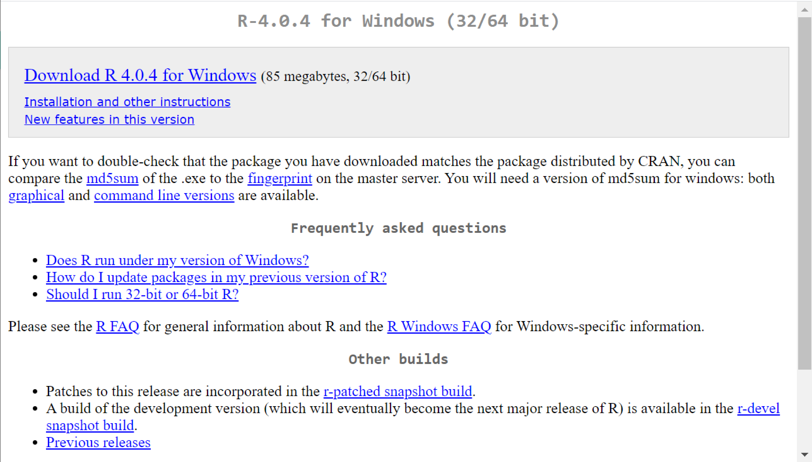
```

<br>

Después de finalizada la descarga abra el archivo **R-4.0.4-win.exe**. Se desplegará una ventana consultando el idioma de instalación. Seleccione **English** y presione **OK** (Figura 2). Es importante que escoja el idioma inglés y no otro.

```{r, fig.align ='center', fig.cap = "Figura 2: Selección de idioma de R.", out.width = "40%", echo = F}
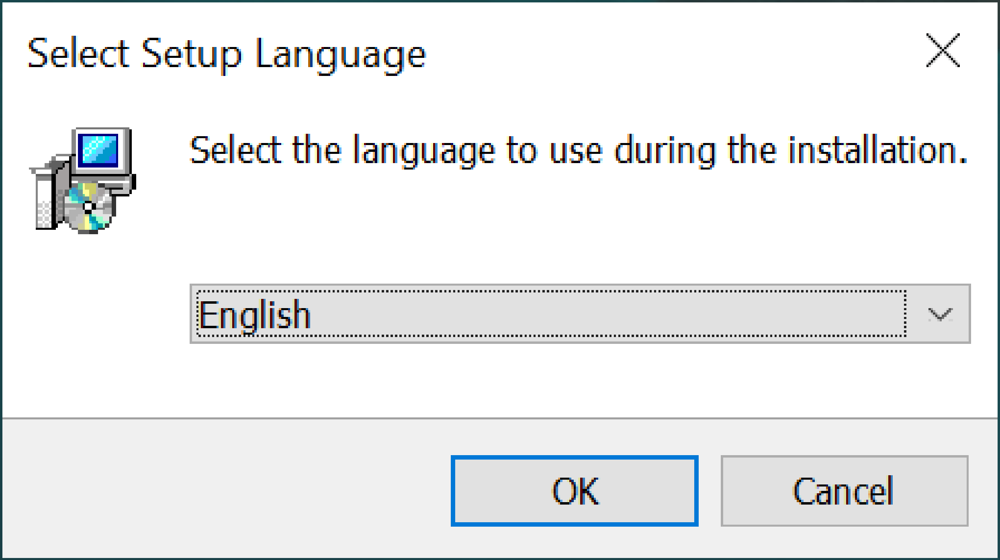
```

<br>

En la ventana siguiente ventana **Information** seleccione **Next \>** (Figura 3).

```{r, fig.align ='center', fig.cap = "Figura 3: Licenciamiento y términos de instalación.", out.width = "65%", echo = F}
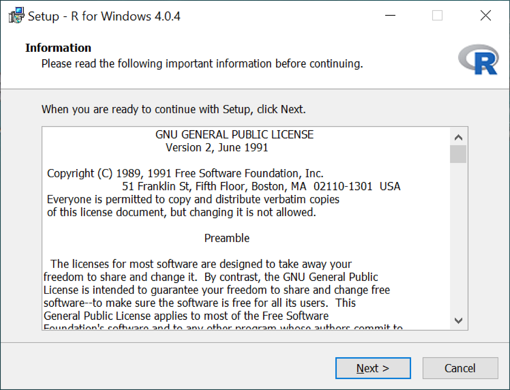
```

<br>

En la ventana **Select Destination Location** acepte la opción que aparezca por defecto (Figura 4) y luego seleccione **Next \>**.

```{r, fig.align ='center', fig.cap = "Figura 4: Directorio de instalación.", out.width = "65%", echo = F}
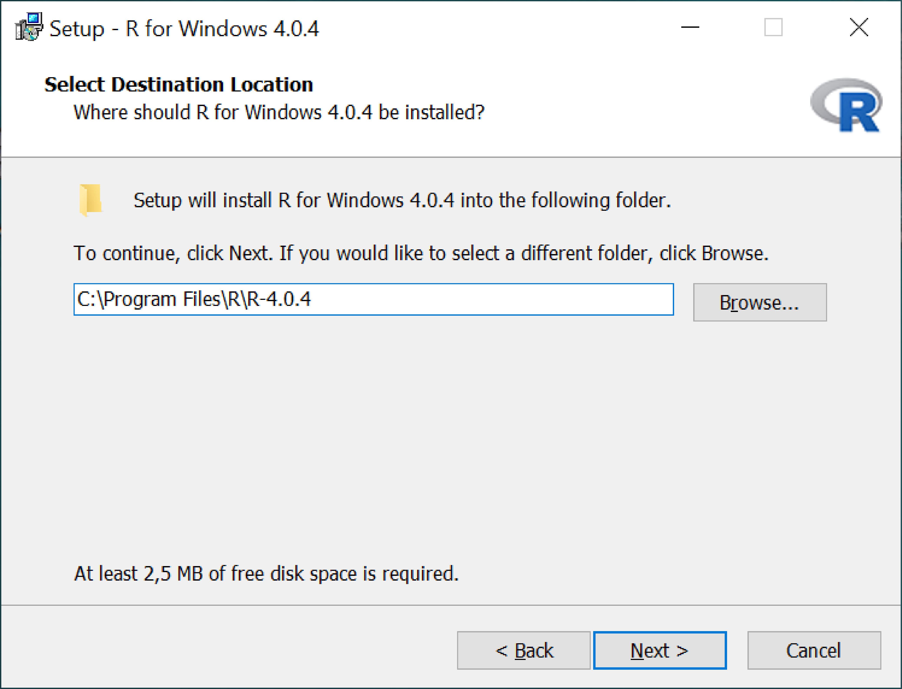
```

<br>

En la ventana **Select Components** escoja la opción correspondiente a su sistema operativo (32 o 64 bits)(Figura 5), y luego seleccione **Next \>**.

```{r, fig.align ='center', fig.cap = "Figura 5: Componentes de instalación.(32 o 64 bits).", out.width = "65%", echo = F}
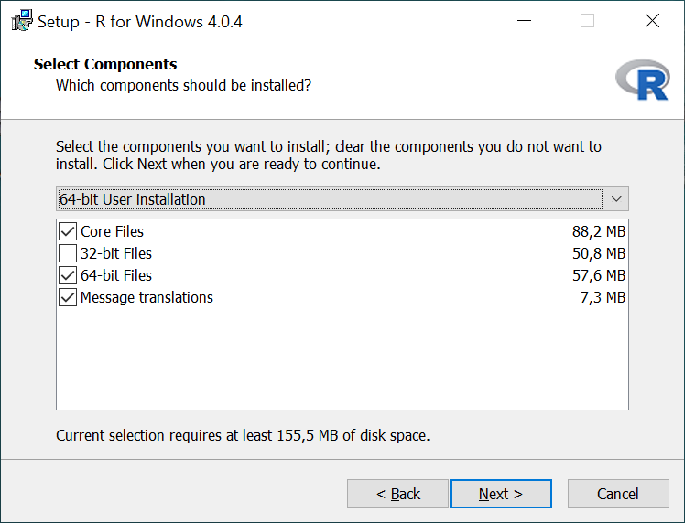
```

<br>

En la ventana **Startup options** seleccione la opción **No (accept defaults)** (Figura 6), y luego escoja **Next \>**.

```{r, fig.align ='center', fig.cap = "Figura 6: Opciones de inicio.", out.width = "65%", echo = F}
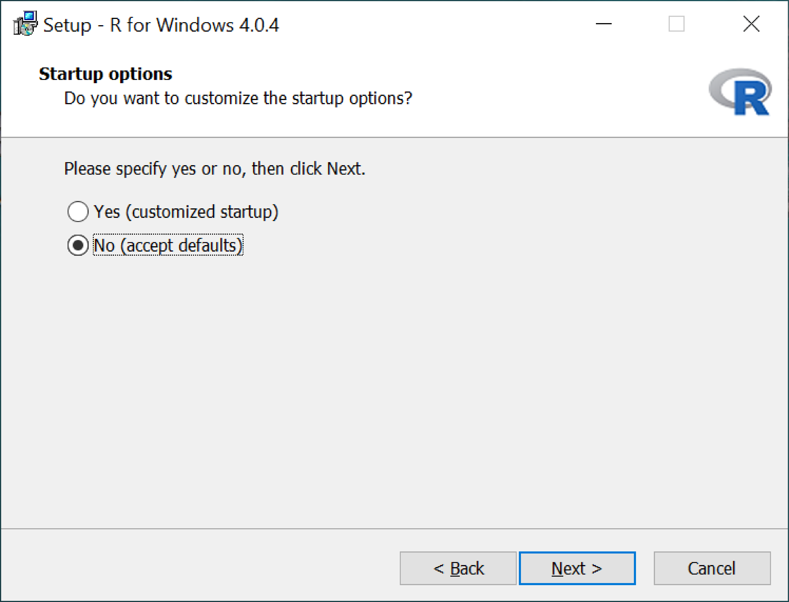
```

<br>

En la ventana **Select Start Menu Folder** acepte la opción que aparezca por defecto (Figura 7), y luego seleccione **Next \>**.

```{r, fig.align ='center', fig.cap = "Figura 7: Carpeta acceso directo en menú inicio.", out.width = "65%", echo = F}
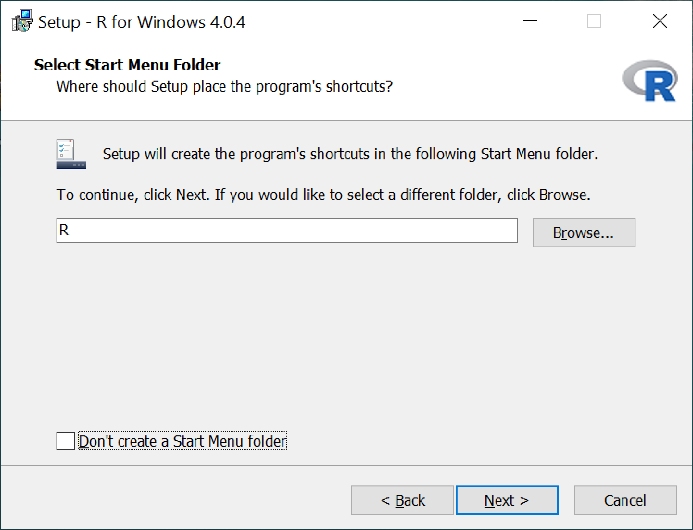
```

<br>

En la ventana **Select Additional Tasks** modifique las casillas que aparezcan de acuerdo a la Figura 8. Finalmente, para comenzar la instalación seleccione le opción **Next \>**.

```{r, fig.align ='center', fig.cap = "Figura 8: Opciones adicionales.", out.width = "65%", echo = F}
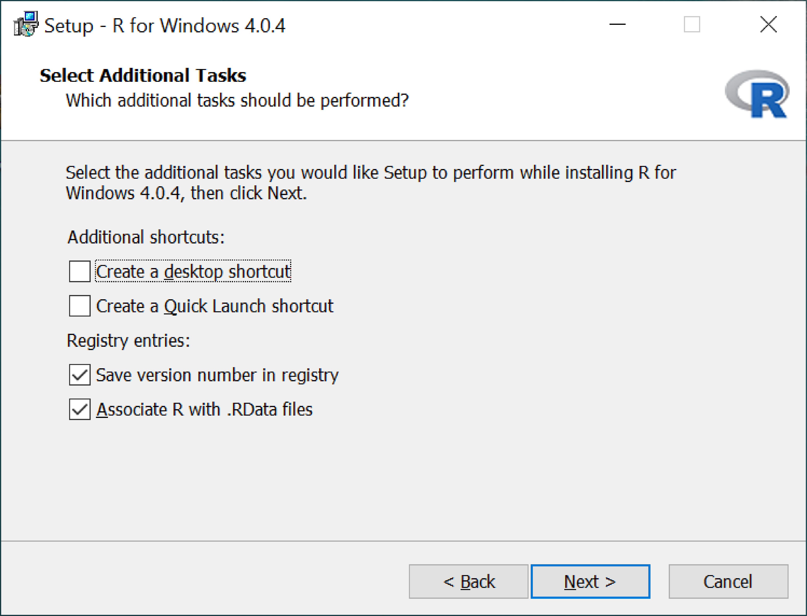
```

<br>

Para estar seguros que R haya quedado instalado correctamente diríjase al **menú inicio \> R \> R x64 4.0.4**, tras lo cual se debe desplegar una ventana similar a la de la Figura 9.

```{r, fig.align ='center', fig.cap = "Figura 9: Ventana principal R.", out.width = "65%", echo = F}
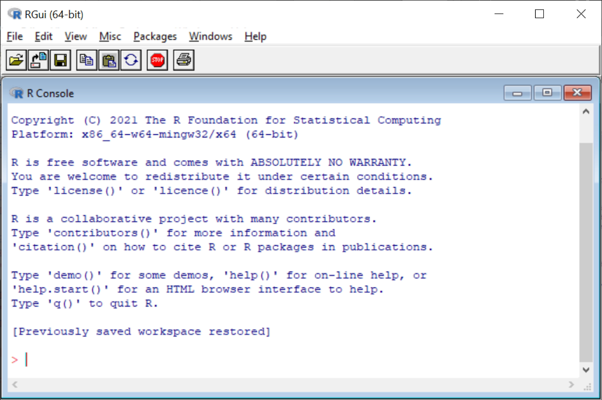
```

<br>

### 1.2 En MacOS

Para instalar R en Mac se debe seguir el mismo procedimiento que para Windows. Ingrese al enlace <https://cran.r-project.org/bin/macosx/> y haga click en [R-4.0.4.pkg](https://cran.r-project.org/bin/macosx/R-4.0.4.pkg) (Imagen 10). Una vez terminada la descarga ejecute el archivo y siga los pasos mencionados para Windows en la sección anterior.

```{r, fig.align ='center', fig.cap = "Figura 10: Ventana principal R.", out.width = "65%", echo = F}
knitr::include_graphics('img/img_mac.png')
```

<br>

## 2. Instalación de RStudio

Para instalar esta aplicación debemos ingresar al sitio web de RStudio y seleccionar alguno de los instaladores disponibles. Ingrese al enlace <https://rstudio.com/products/rstudio/download/> y diríjase a la parte inferior de la página, específicamente en la sección **Installers**. Allí encontrará los instaladores para Windows y MacOS de RStudio correspondiente a la versión **1.4.1106**.

Descargue el instalador de acuerdo a su sistema operativo y abra el archivo una vez finalizada la descarga.

<br>

```{r, fig.align ='center', fig.cap = "Figura 11: Instaladores disponibles de RStudio.", out.width = "65%", echo = F}
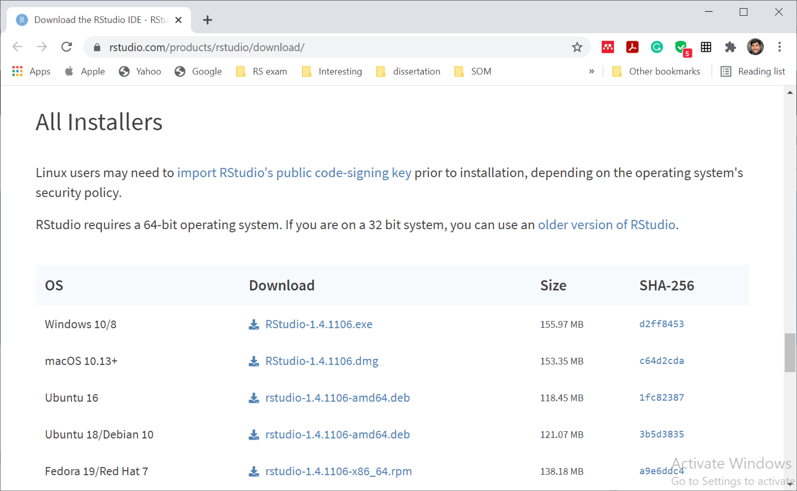
```

<br>

Se desplegará la ventana de inicio a la instalación de RStudio (Figura 11). Haga ckick en **Next >**.

```{r, fig.align ='center', fig.cap = "Figura 12: Ventana inicial para instalar RStudio.", out.width = "65%", echo = F}
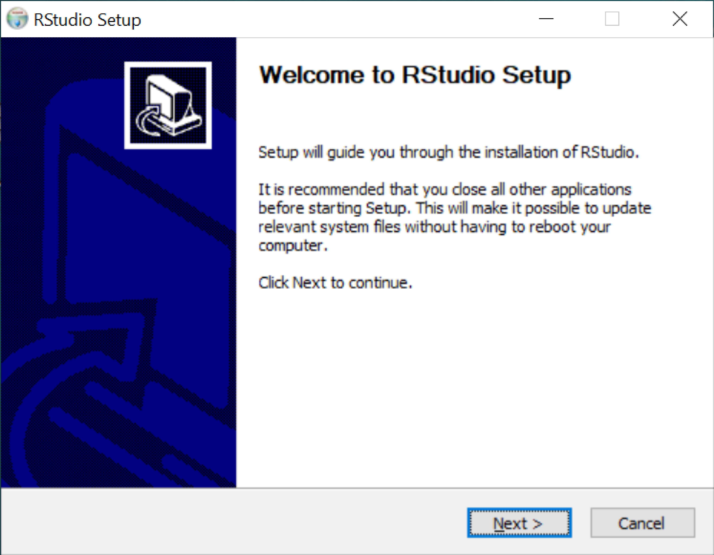
```

<br>

En la ventana **Choose Install Location** acepte la ruta que aparezca por defecto (Imagen 13), y luego haga click en **Next >**.

```{r, fig.align ='center', fig.cap = "Figura 13: .", out.width = "65%", echo = F}
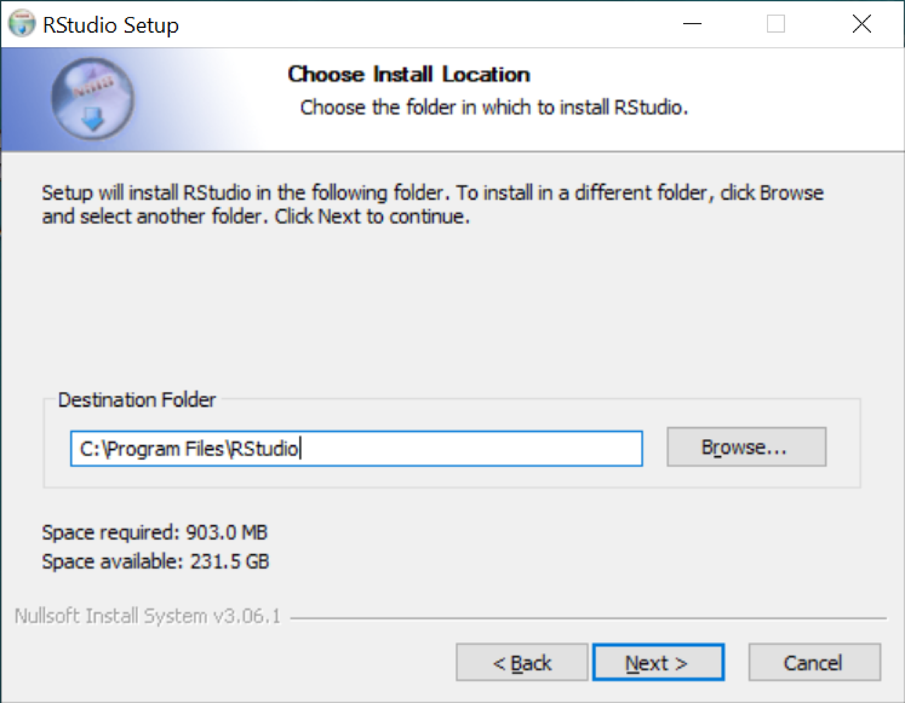
```

<br>

En la siguiente ventana (Choose Start Menu Folder) acepte el nombre que aparezca por defecto (Imagen 14). Para finalizar la instalación haga click en **Install**.

```{r, fig.align ='center', fig.cap = "Figura 14: .", out.width = "65%", echo = F}
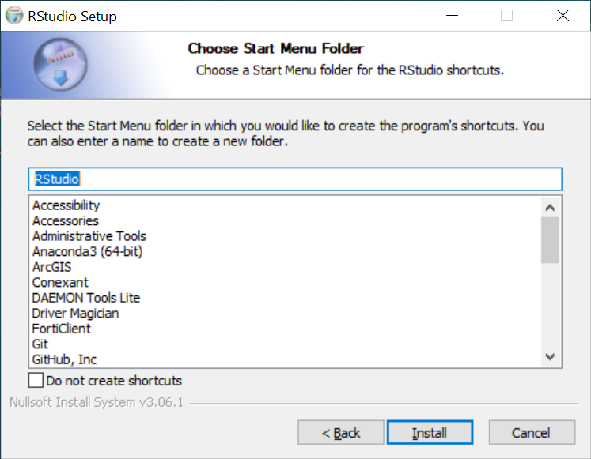
```

<br>

Se desplegará una nueva ventana que muestra el avance de la instalación (Figura 15).

```{r, fig.align ='center', fig.cap = "Figura 15: .", out.width = "65%", echo = F}
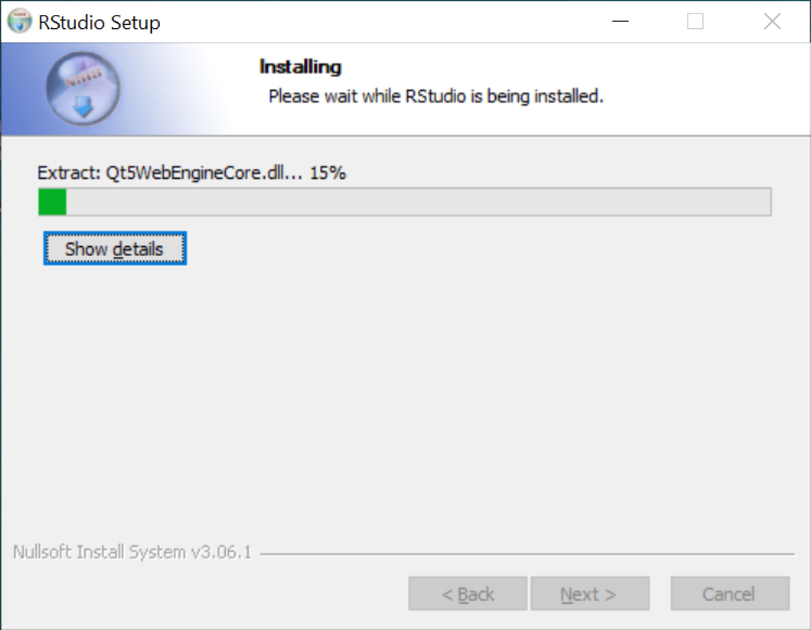
```

<br>

Una vez finalizada la instalación aparecerá una nueva ventana con el mensaje **Completing RStudio Setup** (Figura 16).

```{r, fig.align ='center', fig.cap = "Figura 16: .", out.width = "65%", echo = F}
knitr::include_graphics('img/img_rs6.png')
```

<br>

Finalmente, para estar seguros que RStudio se instaló correctamente diríjase al **menú inicio > RStudio > RStudio**. Si todo se instaló correctamente se debería desplegar una nueva ventana similar a la que muestra la Figura 17.


